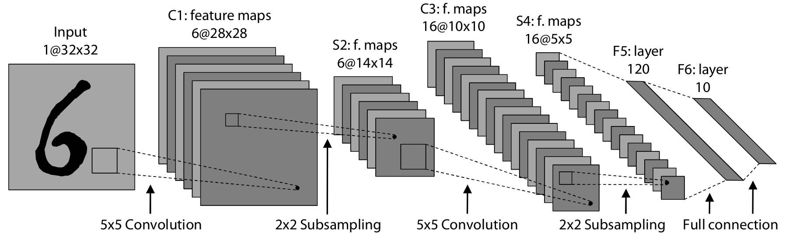

========
Abstract
========

Machine learning algorithms are usually very computational intensive and rather complex in their implementation, especially the well performing ones. In case of neural networks it is mainly the training time which is often very time-consuming. Training of neural networks using a voluminous training dataset can take several days or even weeks. These two points are also valid for the so-called Convolutional Neural Networks (CNNs), invented by Yann LeCun in the early 1990s. However, CNNs deliver state-of-the-art performance on two-dimensional pattern recognition and classification tasks in a broad area of applications.

This work aims at mastering both major drawbacks of CNNs, namely the time-consuming training and the implementation complexity. Therefore, a flexible, high performance but easy-to-use library for CNNs was developed. This library hides the implementation complexity from the user since CNNs can easily be constructed by composing the single types of layers needed for the network. Furthermore, some implementations of well performing networks described in the literature are delivered with this library.

The second main goal of this thesis is to reduce the training time of CNNs and evaluating the performance gains that can be achieved using GPGPU computing in this area of application. To reduce the training time of a CNN our library aims at using the advantages of today's parallel processors. First a reference implementation for x86 multicore CPUs has been designed. In a second step an implementation for CUDA enabled NVIDIA GPUs has been developed. The implementations were used to perform benchmarks in terms of classification rate as well as execution speed using known networks. This work will demonstrate that today's GPUs bear a serious advantage over traditional CPUs in terms of execution speed on this particular kind of machine learning algorithms, reaching speedups of up to 25 times.

For more details, see:

* `mt-strigl-kofler.pdf <https://github.com/dstrigl/cnnplus/blob/master/thesis/mt-strigl-kofler.pdf>`_ and
* `talk.pdf <https://github.com/dstrigl/cnnplus/blob/master/talk/talk.pdf>`_

